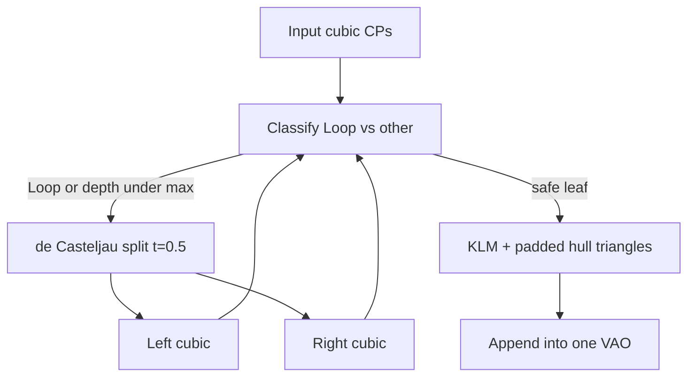

# Subdivide cubics to remove Loop-Blinn phantoms

## Problem

[`cubic_bezier.frag`](src/rendering/shaders/cubic_bezier.frag) strokes the algebraic zero set of \(f = k^3 - lm\) inside the control hull. For **loop**-type cubics (and some cubics that fold back into their hull), that zero set includes an **extra branch**, so a second unwanted stroke appears. Classification already exists in [`ComputeKlm`](src/rendering/LoopBlinnCubic.cpp) (`CubicType::Loop` when `discr < 0`).

## Approach

Subdivide each cubic with **de Casteljau** until pieces are safe to draw as one Loop-Blinn stroke, then build hull+KLM per leaf (shader unchanged).

Concrete rules (fixed defaults):
- **Split when** `Classify` returns `Loop` (primary phantom case).
- **Split at** \(t = 0.5\) (simple, reliable; recursive mid-splits shrink phantoms even if the first cut is not exactly at the double point).
- **Stop when** type is not `Loop`, or **max depth 5** (cap mesh growth).
- **Where:** inside [`LoopBlinnCubicStroke::BuildOnPlane`](src/rendering/LoopBlinnCubic.cpp) so open Bézier, multi-segment path, and B-spline segments all inherit the fix with no caller changes.

## Code changes

### [`src/rendering/LoopBlinnCubic.cpp`](src/rendering/LoopBlinnCubic.cpp)

1. Expose classification for a 2D cubic (reuse existing `ComputeDCoefficients` + `Classify`).
2. Add de Casteljau:
   - `SplitCubic(cps, t, leftOut, rightOut)` at \(t=0.5\).
3. Add recursive collector:
   - `CollectDrawableCubics(cps, depth, out)` → vector of leaf `array<vec2,4>`.
4. Change `BuildOnPlane`:
   - Run collector on `controlPoints`.
   - For each leaf: `ComputeKlm` → hull pad → `TriangulateHull` → append vertices.
   - Upload one combined VBO/VAO (same layout as today).
   - Return false only if no leaf produced triangles.

### No shader / no API change

- [`cubic_bezier.frag`](src/rendering/shaders/cubic_bezier.frag) stays stroke-on-`abs(f)`.
- [`LoopBlinnCubic.h`](src/rendering/LoopBlinnCubic.h) public `Build` / `BuildOnPlane` signatures stay the same.
- [`LoopBlinnCubicPath`](src/rendering/LoopBlinnCubicPath.cpp) / [`LoopBlinnBSpline`](src/rendering/LoopBlinnBSpline.cpp) keep calling `BuildOnPlane` as they do now.

## Verify

- Drag a Bézier into a self-overlapping / loop control polygon: the phantom second stroke should disappear (or be greatly reduced).
- Mild S-curves and open B-splines still draw as before.
- Rebuild Debug after the change.
