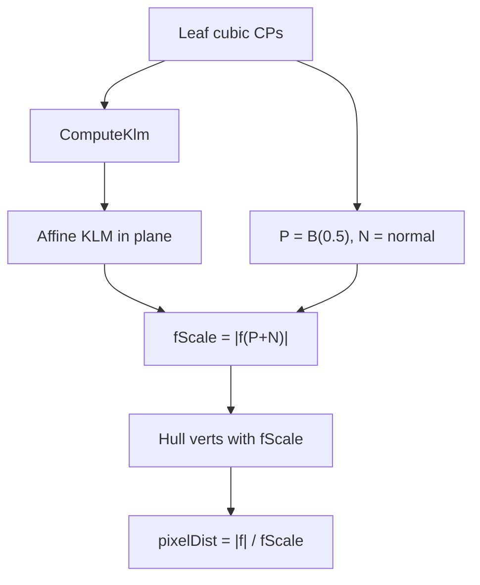

# Per-leaf CPU stroke scale (solution 1)

## Problem

After loop subdivision, some leaf hulls are tiny. Stroke width in [`cubic_bezier.frag`](src/rendering/shaders/cubic_bezier.frag) uses `uHalfWidth * fwidth(f)`. On those leaves `fwidth(f)` collapses → hairline strokes. Flooring `|∇f|` in the shader previously over-accepted fragments and filled whole triangles — do **not** repeat that.

## Approach

For each drawable leaf cubic, estimate on the **CPU** how fast `f = k³ − lm` changes over one unit of plane distance (screen pixels for the usual screen-space path). Store that scale on every vertex of the leaf. The fragment shader converts `|f|` to approximate pixel distance **without** `dFdx`/`fwidth`.

## Code changes

### Vertex layout — [`LoopBlinnCubic.h`](src/rendering/LoopBlinnCubic.h)

Extend `LoopBlinnVertex` with `float fScale` (constant per leaf). Enable attrib location 2 in [`BuildOnPlane`](src/rendering/LoopBlinnCubic.cpp).

### CPU estimate — [`LoopBlinnCubic.cpp`](src/rendering/LoopBlinnCubic.cpp)

Per leaf, after `ComputeKlm` (use **original** leaf CPs + KLM, not padded):

1. Build affine map `(x,y) → (k,l,m)` from the largest-area basis triangle among the 4 CPs (reuse existing barycentric helper).
2. `P = EvalCubic(leaf, 0.5)`, tangent → unit left normal `N`.
3. `fScale = |EvalF(AffineKlm(P + N))|` with offset **1 plane unit** (screen curves are already in pixels).
4. If degenerate, fall back to `1e-4`.

Set `fScale` on every vertex from `TriangulateHull` for that leaf. Keep loop subdivision + hull pad as-is.

### Shaders

- [`cubic_bezier.vert`](src/rendering/shaders/cubic_bezier.vert): `aFScale` → `vFScale`
- [`cubic_bezier.frag`](src/rendering/shaders/cubic_bezier.frag): `pixelDist = abs(f) / max(vFScale, 1e-8)`; smoothstep with `uHalfWidth`; **no** `fwidth`

Copy updated shaders into `build/Debug/shaders` after rebuild.

## Verify

- Looping Bézier: no phantom stroke; width stays similar to non-loop segments.
- No filled control-hull triangles.
- Mild S-curves / B-splines still look normal.
